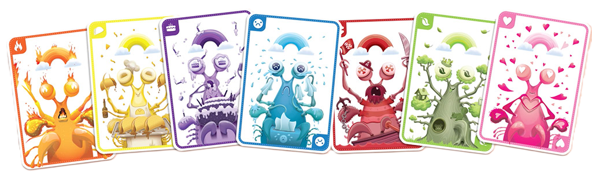
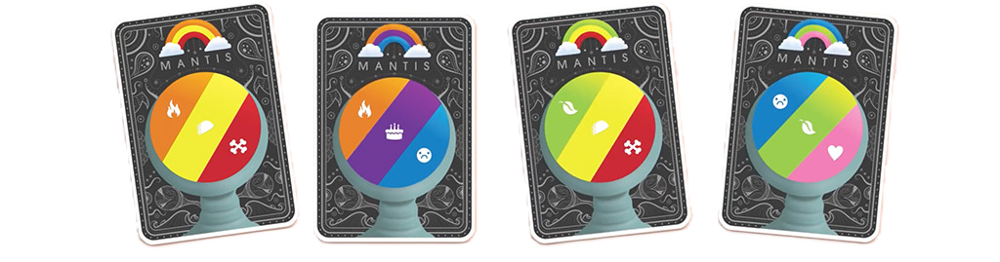
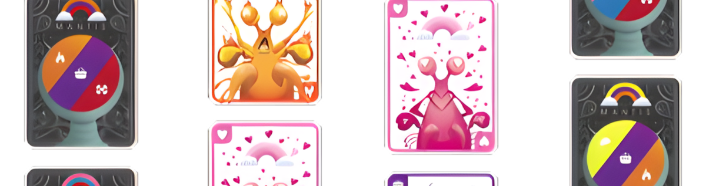
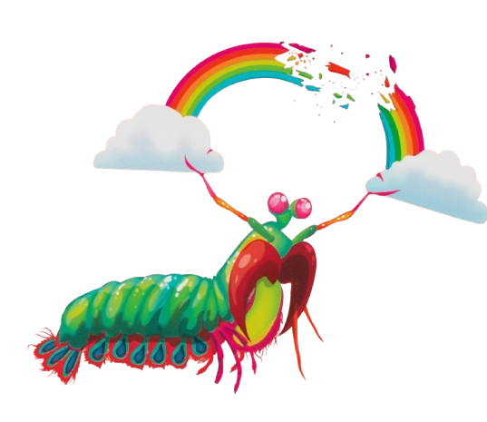

<h1 align="center">
  
</h1>

This project is a digital emulator for the card game [Mantis](https://www.explodingkittens.com/products/mantis).

## 🚀 Features

<div align="center">
  
</div>

- **Game Logic**: Complete game emulation, including game setup, scoring, and stealing.
- **CLI Interface**: A readable and elegant command-line interface.
- **Solo Play**: A variety of built-in strategies for single player or bot matches.
- **Multiplayer**: Highly modular Manual Controllers that allow for many different players.

## 🚧 Upcoming Features

<h1 align="center">
  
</h1>

- **Bot Analytics**: A notebook that analyzes the performance of different bot strategies.
- **PyGame Interface**: A graphical user interface to make the game more visually appealing.
- **Neural Network**: A player powered by ML (Machine Learning) that learns to play Mantis.

## 🕹️ Usage

<div align="center">
  
</div>

This section describes how to run the code. For instructions on how to play Mantis, consult the [official rules](https://www.explodingkittens.com/pages/how-to-play-mantis).

If you don't want to run the project locally, you can also use my [Colab demo](https://colab.research.google.com/drive/1ZNCDydqIY79T9lViSvtTxuxSISGiUHdg?usp=sharing).

1.  **Clone the Repository**:
    ```bash
    git clone https://github.com/ColourlessSpearmint/Mantis.git
    ```
2.  **Navigate to the Directory**:
    ```bash
    cd Mantis
    ```
3.  **Run the Demo**:
    ```bash
    python demo.py
    ```

## ✍️ Author

Developed by **Ethan Marks** ([@ColourlessSpearmint](https://github.com/ColourlessSpearmint)).

README artwork and original game design by the **Exploding Kittens Team** ([Official Website](https://www.explodingkittens.com/pages/about-exploding-kittens)).

## 📜 License

This project is licensed under the [Apache 2.0 License](https://www.apache.org/licenses/LICENSE-2.0).

## 🙏 Credits

Images used in this project are sourced from the official [Mantis website](https://www.explodingkittens.com/products/mantis) and are used for decorative purposes only.

<div align="center">
  
</div>
