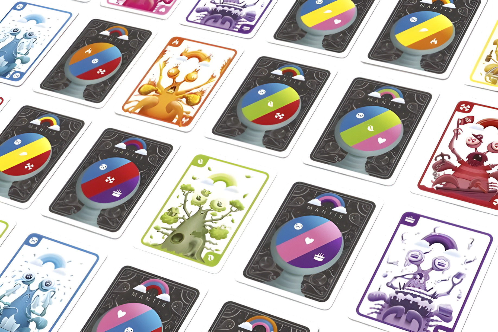

# Mantis Dev Log

This log details my time developing my [Mantis Emulator and Agent](https://github.com/ColourlessSpearmint/Mantis/tree/main). Each entry was written at the end of the day.

  

## December 17, 2024: A Game of Mantis

I played the Mantis card game with my family this evening. My strategy throughout the game was to pick the player with the greatest number of matching colors. About halfway through the game, I started thinking about how repetitive this strategy was. I was reminded of when I had a similar realization with the War card game; I realized that player doesn't actually give any strategic input and is basically just an organic card flipper. After realizing this, I made the decision to start playing Mantis less robotically. Subsequently, I started losing. Then I started scoring cards. Then I lost. 

There's a moral to this story, but I'm not going be the one to figure it out. Instead, I'm going to prevent further losses by determining the best Mantis strategy via brute-forcing it with a neural network.

I've been meaning to do something like this for a while, and I think that Mantis is a good game to train ML with. We'll just have to see.

## December 18, 2024: A Strong Start

At 8:10 this morning, I created a new repo called Mantis. I spent the next four hours planning a project roadmap, writing the README (and learning markdown image syntax), and having ChatGPT draft a project structure. I'm not sure if I'm supposed to create the script files before filling them, but I did. 

After that, I spent two hours designing and implementing the game state encoding. I've decided to store the turn-by-turn data as one big list. Unless I've completely misinterpreted how neural networks are implemented (which is semi-likely), this will make it easier to set up the network inputs. This step was also when I first started using classes.

By "first started using classes", the implied meaning is that it was the first class of the project. What I meant was "this was the first time I'd ever used classes, so I needed to figure out how they worked because I didn't know". I don't think I would have chosen to use classes if the timing hadn't worked out perfectly. As soon as I opened VS Code to start implementing the game state encoding, I noticed a new icon at the top of the editor. As it turns out, the Visual Studio Code team had released [Copilot Free](https://code.visualstudio.com/blogs/2024/12/18/free-github-copilot) while I was designing the encoding. I was excited to try it out. I explained my project to it, and asked it to draft game logic. Before scrapping it and writing my own, I decided to look through its code. I noticed that it was using classes. The more code I looked through, the more I started to realize that using classes was a really good idea. I still scrapped basically all of the code, but the idea for using classes was courtesy of Copilot. I'm not yet sure if classes are a good idea.

Anyways, next I implemented turn actions. It was mostly uneventful. I added a take_turn function that parses the target player and determines if the desired action is scoring or stealing. I'm not sure if it was necessary to create seperate methods for stealing and scoring, but I did.

Next was the playable notebook. It uses the print_state function to give each player information about the game state. Then it asks for their input and simulates a turn based on that. Right now, I only have manual control implemented. I plan to change that tommorrow. 

## December 19, 2024: Bots

Today I programmed bots. 

The first step was to come up with the strategies.

1. MatcherBot: This bot performs my strategy from earlier: if it has the most matching colors, score; otherwise, steal from the player with the most matching colors.
2. ScorerBot: This bot will score if it has any chance of sucessfully scoring; otherwise, it will steal from the player with the most matching colors.
3. ThiefBot: This bot will score if it has a 100% chance of sucessfully scoring; otherwise, it will steal from the player with the most matching colors.
4. RandomBot: This bot will choose a random player. That's it. I decided to add it to filter out bad strategies; if a strategy is consistently beat by RandomBot, it is a bad strategy.

I decided to try out Copilot again and see if it could write the bots. It could not. I probably should have given it a copy of the rules or something, because in addition to not doing what I wanted them to do, most of the bots referenced the card actual, which the players aren't supposed to have access to.

I programmed a bot_duel function that pits all four bots against each other in a simulated game. I noticed that MatcherBot and ScorerBot usually win, but RandomBot and ThiefBot also win occasionally. What's interesting is that RandomBot seems to win more often than ThiefBot. I didn't do it today, but I should definitely write a bot analytic notebook at some point to rank the bots.

Speaking of notebooks, the next step was to integrate the bots into the playable notebook. I had to refactor basically the entire notebook to make this work, but I got it done eventually.

## December 20, 2024: Bugfixes

Today I did a few miscellaneous bugfixes.

- ScorerBot: Why did a strategy named ScorerBot ever do anything other than score? Anyways, I fixed that. It doesn't seem to have effected ScorerBot's effectiveness; it still wins around half of all games. 
- Imports: My local machine and Colab seem to handle file imports differently, so I added some logic that tries multiple import locations. This is a stopgap solution to a problem that I'll have to find a way to permanently resolve.

This was all that I had time for today.

## December 21, 2024: Bot Dueling

Today I made the bot duel notebook.

I had started working on it yesterday, but I didn't have enough time to finish it or commit it. It calls the bot_duel() function a specifiable number of times, collects the results, and plots them with matplotlib. The map_to_bot_names() and plot_common_items() functions were written by Google Gemini. The reason I outsourced writing these menial functions to AI is that I didn't want to write them myself. Anyways, from this I learned that ScorerBot is by far the best strategy when your opponents are MatcherBot, ThiefBot, and RandomBot. 

Next, I added random players to the bot duel notebook. The user specifies a pool of bots, and the script chooses a random selection during for each game. While writing this devlog, I've realized that there is a bug in my implementation. What the notebook is actually tracking and plotting is the win rates of the first, second, third, and fourth players regardless of their strategy. I don't have time to fix this today, so I might do it tomorrow.

## December 27, 2024: Debugging, More Bots, and Tests

It's been a while. I was busy with Christmas-related things for most of the last week, so I didn't have much time to work on this project. The most important things I did were the bugfixes, but I also added some new bots and figured out how to add tests.

### Bigfixes

- Bot Duel Winner Names: Last devlog, I noticed that the bot_duel notebook isn't actually tracking the winning player, and it actually elucidated the advantage of the starting player. I fixed that by tracking the .name (sic) of the winner object rather than the winning player index.
- CollectorBot: I've renamed this bot to CollectorBot because ThiefBot didn't make much sense. Anyways, rather than counting the number of matching cards, CollectorBot counted the quantity of matching cards. This subtle difference meant that it almost never scored, and when it did it was usually for reasons other than what its strategy dictates. I fixed this, and its strategy subsequently rose in the rankings.
- Directory Cleanup: I've decided that the project structure suggested by ChatGPT was bad. I've collapsed src/game and moved eveything into src. Also, I removed most of the unused files (with the exception of the tests).
- Card Dealing: This was a big one. As it turns out, this entire time the reset_state function would occasionally only deal 3 cards to some players. This was due to me forgetting how many colors there were. I fixed that (and refactored the code slightly).

### New Bots

- MinimalistBot: This one is basically just the old ScorerBot strategy under a different name. The name is from the bot's strategy, where it will never score only to add cards to its hand. Naming things is hard, okay?
- JealousBot: I noticed that none of the strategies reference player scores, so I created a bot that chooses the player with the highest score.

### Tests

- Game Logic Tests: In order to verify that the card dealing was fixed, I added a test for it. I also added some more tests for the other functions.
- Bot Tests: To verify that the bots perform as their strategies dictate, I added some tests. I've only tested the first two bots (and the general-purpose MatchPlayer function) so far, and I'll do the rest later. Probably.

## December 30, 2024: Beginning the Neural Network

I've been putting off actually starting work on the neural network, but I had to start working on it at some point. It wasn't actually as much work as I suspected, due in large part because most of the PyTorch code (model.py, replay_buffer.py, train.py) was written by ChatGPT. I wrote env.py to integerate ChatGPT's code with the game logic. The NN doesn't seem to be learning very well, so I'll have to fix that tomorrow. 

## December 31, 2024: Training Loop Experiments

Most of what I did today was just experimenting with changing the training loop to see if I could improve the NN. I think that having instantaneous true random card generation was a bad idea from the perspective of making results reproducable, so I refactored card generation to include a deck that can be overriden. I can't tell if these improvements have helped or not.

## January 5, 2025: More Training Loop Experiments

Happy New Year! I didn't do any coding for the past four days. This wasn't because of any New Year-related festivities, but because I recently bought Factorio: Space Age. The factory must grow.

Anyways, I think that a significant factor to the abysmal learning rate of the NN was that game is completely different in every episode, meaning that the NN doesn't have a chance to develop any strategy. Today I had the script cache the initial game state until it starts winning a lot, allowing the NN to replay it until it gets good at those specific starting conditions.

The win rates are still erratic and vary wildly between executions, but the NN once got up to about 1500/2000 wins. Further experimentation is required.

## March 2, 2025: Refactoring

Remember back on December 27 when I apologized for taking a long six-day break over Christmas from working on this project? It's been nearly a month this time, but I'm back with a bunch of new ideas! 

Idea #1: delete everything and rebuilt it from the ground up.

Idea #2: I don't have any more ideas.

### Refactoring

I've decided to refactor the project from the ground up, as the framework I had built was terrible. I thought that my gamestate idea was genius, but it just restricted what I could do (e.g. not having 4 players). I'm using a bunch more classes this time around to hopefully make it more modular.

When I coded the first few classes and functions, I was being very careful and intentional and professional. Then I started to get bored. I started coding faster and subsequently started making actual progress. It almost immediately devolved into a disorganized and haphazard shantycode. I'll fix it next time maybe.

All of today's code was written manually, and it shows. Claude is better at nice code than I am.